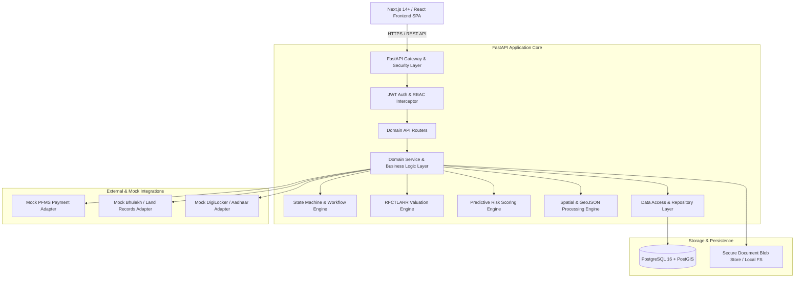
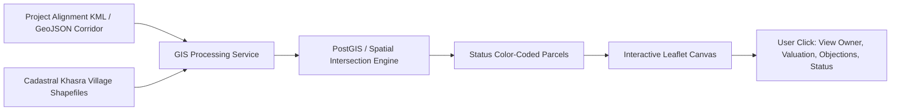
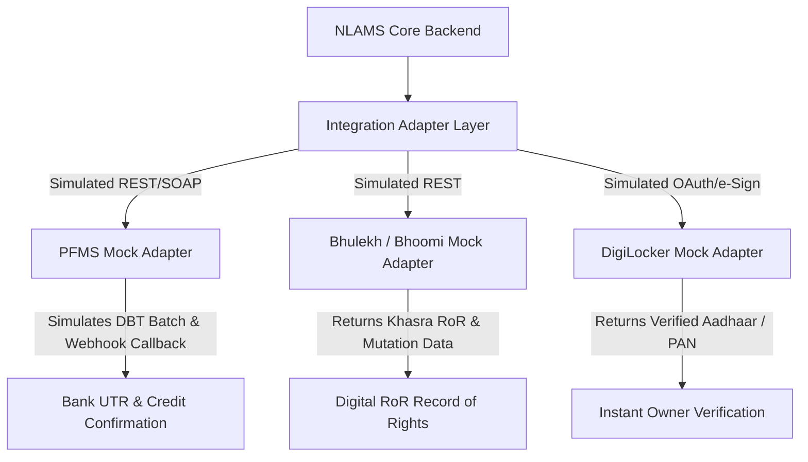

# National Land Acquisition & Management System (NLAMS)
## System Architecture Design Document

---

## 1. Architectural Overview & Design Principles

The NLAMS platform is designed around **Clean Architecture**, **Domain-Driven Design (DDD)**, and **Decoupled Geospatial-Transactional State Management**.



### Core Architecture Principles
1. **Single Source of Truth**: Unified transactional data model ensuring projects, parcels, landowners, notifications, awards, and disbursements remain 100% interconnected without data drift.
2. **Statutory Compliance as Code**: RFCTLARR Act 2013 rules (Sections 11, 15, 19, 23, 26–30, 31, 38) are codified as deterministic calculation engines and validation state guards.
3. **Stateless Scalability**: FastAPI backend with stateless JWT bearer tokens and connection-pooled async PostgreSQL access.
4. **Resilient GIS Superimposition**: Decoupled spatial engine converting CAD/KML/GeoJSON engineering alignments into standard WGS84 GeoJSON polygons overlaid on village cadastral maps.
5. **Auditability & Non-Repudiation**: Every state mutation, valuation override, and document approval generates an immutable audit record with cryptographic hash integrity.

---

## 2. Frontend Architecture

### 2.1 Technology Selection
- **Framework**: Next.js 14+ (App Router with TypeScript)
- **Styling**: Tailwind CSS + shadcn/ui component primitives (built on Radix UI)
- **State & Server Cache Management**: TanStack Query (React Query v5) for server state caching + Zustand for client UI state (role toggle, filter state, map active layers)
- **GIS / Mapping**: `Leaflet` + `react-leaflet` with custom vector styling, polygon click-inspectors, alignment buffer visualizers, and OpenStreetMap/Bhuvan raster tile providers
- **Data Visualizations**: `Recharts` for interactive progress charts, financial s-curves, land acquisition milestone funnels, and risk distributions
- **Icons & UI Typography**: `lucide-react`, Google Fonts (Inter / Outfit)

### 2.2 Frontend Module Organization
```
frontend/
├── src/
│   ├── app/                    # Next.js App Router (Routes & Layouts)
│   │   ├── (auth)/             # Login, Register, Forgot Password
│   │   ├── (dashboard)/        # Role-aware main shell
│   │   │   ├── national/       # Central Officer High-level view
│   │   │   ├── state/          # State Officer regional view
│   │   │   ├── district/       # District CALA operational view
│   │   │   ├── projects/       # Projects list, creation, details
│   │   │   ├── workflow/       # Active approval task queue
│   │   │   ├── parcels/        # Cadastral land parcel registry
│   │   │   ├── gis/            # Fullscreen interactive GIS map
│   │   │   ├── compensation/   # Valuation & calculator module
│   │   │   ├── awards/         # Section 23/30 Award declaration
│   │   │   ├── disbursements/  # PFMS payment tracking & batch DBT
│   │   │   ├── possession/     # Section 38 possession & handover
│   │   │   ├── randr/          # Rehabilitation & Resettlement tracking
│   │   │   ├── documents/      # Document repository & verifier
│   │   │   ├── analytics/      # MIS reports & predictive risk radar
│   │   │   └── audit/          # System audit trail logs
│   ├── components/
│   │   ├── ui/                 # Reusable shadcn/ui atoms (Button, Card, Dialog, Table, etc.)
│   │   ├── layout/             # Sidebar, Header, RoleSwitcher, NotificationTray
│   │   ├── gis/                # LeafletMap, ParcelLayer, AlignmentLayer, LayerControls, ParcelDrawer
│   │   ├── workflow/           # StageTimeline, TaskApprovalCard, TransitionModal, StatusBadge
│   │   ├── compensation/       # SolatiumBreakdownTable, MultiplierCalculator, ValuationForm
│   │   ├── charts/             # AcquisitionFunnelChart, FinancialBurnChart, RiskRadarChart
│   │   └── shared/             # StatCard, DataTable, FileUploader, EmptyState, ConfirmDialog
│   ├── lib/
│   │   ├── api/                # Typed Axios / Fetch API client functions
│   │   ├── hooks/              # Custom React hooks (useAuth, useWorkflow, useGIS, useProject)
│   │   ├── stores/             # Zustand stores (authStore, gisStore, uiStore)
│   │   ├── utils/              # Currency formatters, date formatters, geometry utilities
│   │   └── types/              # Full TypeScript interfaces mirror backend schemas
```

---

## 3. Backend Architecture

### 3.1 Technology Selection
- **Framework**: FastAPI (Python 3.11+)
- **Asynchronous IO**: ASGI-based Uvicorn with async/await database operations
- **Data Validation & Serialization**: Pydantic v2 (strict type checking, custom field validators)
- **Database ORM**: SQLAlchemy 2.0 (Async declarative ORM with asyncpg / psycopg3 driver)
- **Migration Engine**: Alembic for automated schema revision history
- **Security & Cryptography**: `passlib` with `bcrypt` / `argon2-cffi`, `python-jose` for JWT claims

### 3.2 Backend Layered Directory Structure
```
backend/
├── app/
│   ├── api/                    # API Route definitions
│   │   ├── v1/
│   │   │   ├── endpoints/      # Domain specific router endpoints
│   │   │   │   ├── auth.py
│   │   │   │   ├── users.py
│   │   │   │   ├── projects.py
│   │   │   │   ├── workflow.py
│   │   │   │   ├── parcels.py
│   │   │   │   ├── owners.py
│   │   │   │   ├── notifications.py
│   │   │   │   ├── compensation.py
│   │   │   │   ├── awards.py
│   │   │   │   ├── disbursements.py
│   │   │   │   ├── possession.py
│   │   │   │   ├── randr.py
│   │   │   │   ├── documents.py
│   │   │   │   ├── gis.py
│   │   │   │   ├── analytics.py
│   │   │   │   ├── reports.py
│   │   │   │   ├── alerts.py
│   │   │   │   ├── audit.py
│   │   │   │   └── mock_integrations.py
│   │   │   └── api.py          # Master v1 router aggregator
│   ├── core/                   # Core application configuration
│   │   ├── config.py           # Environment variables (Pydantic BaseSettings)
│   │   ├── security.py         # JWT encode/decode, password hashers
│   │   ├── database.py         # Async engine & sessionmaker
│   │   ├── exceptions.py       # Custom HTTP domain exceptions
│   │   └── permissions.py      # Declarative RBAC permission helpers
│   ├── models/                 # SQLAlchemy DB Model Definitions
│   │   ├── user.py
│   │   ├── location.py         # State, District, Tehsil, Village
│   │   ├── project.py
│   │   ├── workflow.py
│   │   ├── parcel.py
│   │   ├── owner.py
│   │   ├── notification.py
│   │   ├── compensation.py
│   │   ├── award.py
│   │   ├── disbursement.py
│   │   ├── possession.py
│   │   ├── randr.py
│   │   ├── document.py
│   │   ├── alert.py
│   │   └── audit.py
│   ├── schemas/                # Pydantic Schemas for Request/Response serialization
│   ├── services/               # Business Logic Layer
│   │   ├── workflow_service.py # State transitions, SLA enforcement
│   │   ├── valuation_service.py# RFCTLARR calculation logic
│   │   ├── risk_service.py     # Predictive risk score calculation
│   │   ├── gis_service.py      # Spatial buffer & GeoJSON processing
│   │   ├── audit_service.py    # Non-repudiation audit recorder
│   │   └── mock_service.py     # PFMS, Bhulekh & DigiLocker mocks
│   └── seed/                   # Database seeders (Delhi-Jaipur benchmark project)
```

---

## 4. Database Architecture

### 4.1 Storage Engine & Spatial Strategy
- **Engine**: PostgreSQL 16
- **Spatial Capability**: PostGIS extension enabled (storing parcel boundary polygons, project centerlines, survey points as `GEOMETRY(Polygon, 4326)` or normalized GeoJSON `JSONB` with spatial bounding box indexing).
- **Indexing Strategy**:
  - B-Tree indexes on all foreign keys (`project_id`, `district_id`, `parcel_id`, `owner_id`, `stage_id`).
  - Compound indexes on operational query paths (e.g. `(project_id, status)`, `(district_id, is_active)`).
  - GiST spatial index on polygon/geometry fields for sub-second spatial intersection queries (`ST_Intersects`, `ST_DWithin`).
  - GIN indexes on JSONB metadata and full-text search columns.

---

## 5. Authentication & Role-Based Access Control (RBAC) Architecture

### 5.1 Authentication Flow
1. **Login**: User submits username/email and password.
2. **Verification**: Backend validates password hash via Argon2/bcrypt.
3. **Token Generation**: Issues signed `access_token` (JWT with user ID, assigned role, state/district jurisdiction, expiration: 60 mins) and `refresh_token` (expiration: 7 days).
4. **Demo Impersonation / Role Switching**: Built-in, audited quick-switch capability allowing judges and evaluators to switch between `CENTRAL_OFFICER`, `DISTRICT_OFFICER`, `PROJECT_AGENCY`, and `FIELD_OFFICER` instantly.

### 5.2 Role & Permission Matrix

| Capability / Module | CENTRAL_OFFICER | STATE_OFFICER | DISTRICT_OFFICER | PROJECT_AGENCY | FIELD_OFFICER | ADMIN |
|---|:---:|:---:|:---:|:---:|:---:|:---:|
| **Project Creation & DPR Upload** | Read | Read | Read | **Create/Edit** | - | Manage |
| **Project Scrutiny & Sanction** | **Sanction** | Review | **Scrutinize** | View | - | Manage |
| **Cadastral Ground Verification** | View | View | Verify | View | **Survey/Submit** | Manage |
| **Issue Section 11/19 Notifications** | View | Review/Gazette | **Issue/Sign** | View | View | Manage |
| **Objection Hearing & Disposal** | View | View | **Hear/Dispose** | Attend | Support | Manage |
| **Compensation & Solatium Calculation** | View | View | **Finalize/Approve** | Review | Field Input | Manage |
| **Section 23/30 Award Declaration** | View | View | **Pass Award** | Receive | - | Manage |
| **Disbursement / PFMS Approval** | National View | State View | **Approve DBT** | Deposit Funds | - | Telemetry |
| **Possession Handover Certificate** | View | View | **Execute Handover**| **Take Possession**| Boundary Mark | Manage |
| **R&R Entitlement & Allotment** | National View | Monitor | **Approve R&R** | Execute Works | Enumerate | Manage |
| **Predictive Risk & Analytics** | **Full Access** | **State Access** | **District Access**| **Project Access**| Local View | Full Access |
| **Audit Logs & System Admin** | Read-Only | Read-Only | Read-Only | - | - | **Full Admin** |

---

## 6. Acquisition Workflow & State Machine Architecture

The lifecycle follows a deterministic, 11-stage finite state machine:

```
[1. PROJECT_PROPOSAL]
        ↓ (Agency submits DPR & Alignment)
[2. SCRUTINY]
        ↓ (District CALA approves preliminary scrutiny & SIA review)
[3. LAND_IDENTIFICATION]
        ↓ (Superimpose alignment with Cadastral Khasra maps)
[4. LAND_VERIFICATION]
        ↓ (Field Officer completes ground truthing & tree/structure valuation)
[5. NOTIFICATION]
        ↓ (Issue Section 11 Preliminary Notification -> Section 15 Hearings -> Section 19 Declaration)
[6. COMPENSATION_ASSESSMENT]
        ↓ (Automated RFCTLARR solatium, multiplier & asset valuation calculation)
[7. AWARD_DECLARATION]
        ↓ (CALA declares Section 23/30 statutory award)
[8. COMPENSATION_DISBURSEMENT]
        ↓ (Direct Benefit Transfer via PFMS simulation to verified owner bank accounts)
[9. POSSESSION]
        ↓ (Execute Section 38 Possession Handover certificate; site cleared)
[10. REHABILITATION_RESETTLEMENT]
        ↓ (Allotment of homestead plots, subsistence allowance, community amenities)
[11. COMPLETION]
        (Final audit, closure report, hand over to engineering construction team)
```

- **Transition Guards**: Strict validation before any stage transition (e.g. Stage 7 `AWARD_DECLARATION` is blocked if 100% of parcels lack approved Section 19 notification or completed valuation).
- **Audit Logs**: Every transition logs `from_stage`, `to_stage`, `triggered_by_user_id`, `approval_notes`, and a snapshot of metrics.

---

## 7. GIS & Spatial Superimposition Architecture



- **Vector Layer 1 (Project Corridor)**: Centerline + 30m/60m Right-of-Way (RoW) buffer zone.
- **Vector Layer 2 (Cadastral Khasra Parcels)**: Village parcel polygons color-coded by acquisition status:
  - 🟡 *Yellow*: Under Verification
  - 🔵 *Blue*: Notified (Section 11/19)
  - 🟠 *Orange*: Valuation / Award Passed
  - 🟢 *Green*: Compensation Disbursed & Possession Taken
  - 🔴 *Red*: High Risk / Disputed / Court Injunction
- **Spatial Queries**: Automated detection of overlapping parcels, boundary conflicts, and forest/environmental restricted zones.

---

## 8. Document Management & Non-Repudiation Architecture

- **Document Ingestion**: Supports PDF, scanned maps, field survey images, and signed award notices.
- **Integrity Verification**: Generates a **SHA-256 cryptographic hash** upon upload. When inspecting a document, the system computes the real-time hash to guarantee the file has not been altered or tampered with.
- **Document Metadata**: Linked directly to `project_id`, `parcel_id`, `award_id`, or `disbursement_id`.
- **Status Lifecycle**: `UPLOADED` → `UNDER_VERIFICATION` → `VERIFIED` (or `REJECTED` with statutory reason).

---

## 9. Analytics, Predictive Risk Intelligence & MIS Reporting Layer

### 9.1 Real-Time PostgreSQL Aggregation Engine
The analytics layer computes KPIs dynamically directly from PostgreSQL operational tables, avoiding hardcoded or disconnected benchmarks:
- **National / State / District Aggregation**: Projects count, active/completed status, land proposed vs acquired, compensation assessed vs awarded vs disbursed vs outstanding (in ₹ Crores), possession taken, and affected families with R&R completion %.
- **8-Stage Acquisition Funnel**: Clear step-by-step funnel tracking projects, land proposed, land verified, compensation assessed, awards declared, disbursed, possession taken, and R&R completed with proper dimensional units (count, acres, ₹ Cr, PAFs).
- **Time-Series & Milestones**: Historical timeline derived from real creation/approval timestamps for projects, awards, disbursements, and possession.
- **Bottleneck & Data Quality Engine**: Automatic detection of overdue workflow tasks, high outstanding compensation, delayed possession, and financial consistency reconciliation checks (Disbursed ≤ Awarded, Acquired ≤ Proposed).

### 9.2 Predictive Risk Intelligence Engine (0 to 100 Risk Index)
A transparent, configurable rule-based decision-support engine scoring projects from 0 to 100 across 5 statutory factors:
1. **Workflow Delay Risk (Weight 20%)**: Proportion of overdue workflow approval tasks and overall stage SLA drift.
2. **Land / Parcel Verification Risk (Weight 20%)**: Ratio of unverified or disputed parcels relative to total project parcels.
3. **Compensation & Disbursement Risk (Weight 25%)**: Percentage of assessed compensation remaining undisbursed or un-awarded.
4. **Dispute & Litigation Risk (Weight 15%)**: Unresolved Section 15 objections, disputed titles, and pending ownership claims.
5. **R&R & Possession Lag Risk (Weight 20%)**: Unsettled Project Affected Families (PAFs) and parcels with delayed physical handover after award declaration.

**Score Interpretation**:
- `0–24`: **LOW RISK** (Green) — Progressing normally within statutory RFCTLARR schedules.
- `25–49`: **MODERATE RISK** (Yellow) — Minor milestones or verification lags; monitoring advised.
- `50–74`: **HIGH RISK** (Orange) — Significant overdue tasks or disbursement bottlenecks; proactive CALA intervention required.
- `75–100`: **CRITICAL RISK** (Red) — Severe statutory drift, Section 25 lapsing vulnerability, or unresolved major dispute; immediate escalation mandated.

### 9.3 Statutory MIS Reporting & Multi-Format Export Engine
- **7 Pre-Built Standard Report Templates**:
  1. National Acquisition Progress Summary
  2. State-Wise Acquisition & Land Summary
  3. Comprehensive Project Progress Report
  4. Compensation & Disbursement Financial Report
  5. Physical Land Possession Status Report
  6. Affected Families & R&R Entitlement Report
  7. Risk Intelligence & Bottleneck Audit Report
- **Live Preview**: Paginated interactive preview with summary KPIs and column headers.
- **Backend PDF Generation**: Clean government-formatted PDF generation using `reportlab` with official NLAMS branding, generation timestamps, tabular layouts, and dynamic page numbering.
- **Backend Excel Generation**: Structured multi-sheet `.xlsx` workbooks generated via `openpyxl` with styled metadata headers and typed numerical columns.
- **Role-Based Security & Jurisdiction**: RBAC strictly enforced in backend queries so district or state officers only see data within their authorized jurisdiction.

---

## 10. Integration Architecture (Mock Adapters)

To ensure high realism during demonstration without external dependencies, standard interface adapters simulate actual Indian government endpoints:



1. **Mock PFMS (Public Financial Management System)**: Simulates payment batch generation, e-payment file dispatch, and asynchronous bank webhook callbacks returning simulated UTR numbers.
2. **Mock Bhulekh / Land Records**: Simulates fetching digital Record of Rights (RoR), Khasra/Khata numbers, mutation history, and encumbrance certificates.
3. **Mock DigiLocker & e-Sign**: Simulates instant Aadhaar/PAN identity verification and CALA digital signature stamping on Section 23 Awards.
