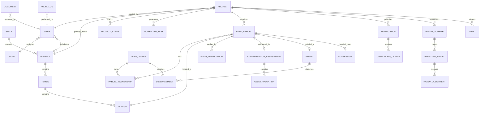

# National Land Acquisition & Management System (NLAMS)
## Database Conceptual & Logical Schema

---

## 1. Entity-Relationship Overview

The database schema is organized into 6 core domains:
1. **Identity & Administration**: `users`, `roles`, `permissions`, `audit_logs`
2. **Administrative Hierarchy**: `states`, `districts`, `tehsils`, `villages`
3. **Projects & Workflow**: `projects`, `project_stages`, `stage_transition_history`, `workflow_tasks`, `alerts`
4. **Cadastre, Land & Ownership**: `land_parcels`, `land_owners`, `parcel_ownerships`, `field_verifications`
5. **Statutory RFCTLARR Lifecycle**: `notifications`, `objections_claims`, `compensation_assessments`, `asset_valuations`, `awards`, `disbursements`, `possessions`
6. **Rehabilitation & Resettlement**: `randr_schemes`, `affected_families`, `randr_allotments`, `documents`

---

## 2. Table Specifications & Attributes

### 2.1 Identity & Administrative Hierarchy

#### `roles`
| Field | Type | Modifiers | Description |
|---|---|---|---|
| `id` | VARCHAR(36) | PK | Unique identifier (e.g. `ROLE_CENTRAL_OFFICER`) |
| `name` | VARCHAR(50) | UNIQUE, NOT NULL | Display name |
| `description` | TEXT | NULL | Role description and scope |
| `created_at` | TIMESTAMP | DEFAULT NOW() | Record creation timestamp |

#### `users`
| Field | Type | Modifiers | Description |
|---|---|---|---|
| `id` | UUID | PK, DEFAULT gen_random_uuid() | Unique user identifier |
| `role_id` | VARCHAR(36) | FK -> roles.id, NOT NULL | User's active system role |
| `email` | VARCHAR(120) | UNIQUE, NOT NULL | Official email address |
| `username` | VARCHAR(50) | UNIQUE, NOT NULL | Login username |
| `hashed_password` | VARCHAR(255) | NOT NULL | Argon2 / bcrypt hash |
| `full_name` | VARCHAR(100) | NOT NULL | Officer full name |
| `designation` | VARCHAR(100) | NOT NULL | Designation (e.g. CALA & ADM) |
| `organization` | VARCHAR(100) | NOT NULL | Organization (NHAI, Revenue Dept) |
| `state_id` | VARCHAR(10) | FK -> states.id, NULL | State jurisdiction |
| `district_id` | VARCHAR(10) | FK -> districts.id, NULL | District jurisdiction |
| `is_active` | BOOLEAN | DEFAULT TRUE | Active account flag |
| `last_login_at` | TIMESTAMP | NULL | Last login timestamp |
| `created_at` | TIMESTAMP | DEFAULT NOW() | Account creation date |

#### `states` & `districts` & `tehsils` & `villages`
- `states`: `id` (PK, ISO code e.g. `IN-RJ`), `name`, `code`.
- `districts`: `id` (PK e.g. `DST-JAI`), `state_id` (FK), `name`, `lgd_code` (Local Gov Directory code).
- `tehsils`: `id` (PK), `district_id` (FK), `name`.
- `villages`: `id` (PK), `tehsil_id` (FK), `name`, `census_code`, `circle_rate_rural_factor` (1.00 to 2.00).

---

### 2.2 Projects & Workflow Engine

#### `projects`
| Field | Type | Modifiers | Description |
|---|---|---|---|
| `id` | UUID | PK, DEFAULT gen_random_uuid() | Project unique identifier |
| `project_code` | VARCHAR(50) | UNIQUE, NOT NULL | e.g. `NHAI-NH48-EXP-PKG4` |
| `title` | VARCHAR(200) | NOT NULL | Project title |
| `description` | TEXT | NOT NULL | Comprehensive project description |
| `sponsoring_ministry` | VARCHAR(100) | NOT NULL | e.g. `Ministry of Road Transport & Highways` |
| `implementing_agency` | VARCHAR(100) | NOT NULL | e.g. `NHAI` |
| `current_stage` | VARCHAR(40) | NOT NULL | Current lifecycle stage code |
| `total_land_proposed_acres` | NUMERIC(10, 4) | NOT NULL | Total land required in acres |
| `total_land_acquired_acres` | NUMERIC(10, 4) | DEFAULT 0.0 | Total land acquired so far |
| `total_possession_acres` | NUMERIC(10, 4) | DEFAULT 0.0 | Total land possession taken |
| `estimated_budget_inr_cr` | NUMERIC(12, 2) | NOT NULL | Estimated acquisition budget in Crores |
| `compensation_assessed_cr` | NUMERIC(12, 2) | DEFAULT 0.0 | Total assessed compensation in Crores |
| `compensation_disbursed_cr` | NUMERIC(12, 2) | DEFAULT 0.0 | Total compensation paid in Crores |
| `total_paf_count` | INT | DEFAULT 0 | Total Project Affected Families |
| `total_pdf_count` | INT | DEFAULT 0 | Total Project Displaced Families |
| `randr_completion_percent` | NUMERIC(5, 2) | DEFAULT 0.0 | Percentage R&R works completed |
| `alignment_geojson` | JSONB | NULL | Alignment centerline & buffer polygon |
| `risk_score` | INT | DEFAULT 0 | Overall predictive risk score (0-100) |
| `created_by_user_id` | UUID | FK -> users.id, NOT NULL | Creator user ID |
| `created_at` | TIMESTAMP | DEFAULT NOW() | Timestamp created |
| `updated_at` | TIMESTAMP | DEFAULT NOW() | Timestamp updated |

#### `project_stages` & `stage_transition_history`
- `project_stages`: `id`, `project_id` (FK), `stage_code` (ENUM 1-11), `status` (`PENDING`, `IN_PROGRESS`, `COMPLETED`, `BLOCKED`), `started_at`, `completed_at`, `sla_deadline_days`.
- `stage_transition_history`: `id`, `project_id` (FK), `from_stage`, `to_stage`, `triggered_by_user_id` (FK), `decision` (`APPROVED`, `REJECTED`, `OVERRIDDEN`), `remarks`, `snapshot_metrics_json`, `created_at`.

#### `workflow_tasks`
- `id`: UUID (PK)
- `project_id`: UUID (FK -> projects.id)
- `task_type`: VARCHAR(50) (e.g. `SCRUTINY_REVIEW`, `GROUND_VERIFICATION`, `SEC19_APPROVAL`, `AWARD_SIGNING`)
- `assigned_role`: VARCHAR(36) (FK -> roles.id)
- `assigned_user_id`: UUID (FK -> users.id, NULL)
- `status`: VARCHAR(20) (`PENDING`, `IN_REVIEW`, `COMPLETED`, `REJECTED`)
- `priority`: VARCHAR(20) (`NORMAL`, `HIGH`, `CRITICAL`)
- `due_date`: DATE
- `completed_at`: TIMESTAMP
- `action_url`: VARCHAR(255)

---

### 2.3 Cadastral Land & Ownership

#### `land_parcels`
| Field | Type | Modifiers | Description |
|---|---|---|---|
| `id` | UUID | PK, DEFAULT gen_random_uuid() | Parcel unique identifier |
| `project_id` | UUID | FK -> projects.id, NOT NULL | Associated acquisition project |
| `village_id` | VARCHAR(10) | FK -> villages.id, NOT NULL | Revenue village |
| `khasra_number` | VARCHAR(50) | NOT NULL | Cadastral Khasra / Survey Number |
| `khata_number` | VARCHAR(50) | NOT NULL | Revenue Khata Number |
| `total_area_sqm` | NUMERIC(12, 2) | NOT NULL | Total parcel area |
| `acquired_area_sqm` | NUMERIC(12, 2) | NOT NULL | Area required for acquisition |
| `land_type` | VARCHAR(30) | NOT NULL | `AGRICULTURAL_IRRIGATED`, `AGRICULTURAL_UNIRRIGATED`, `COMMERCIAL`, `RESIDENTIAL`, `GOVERNMENT_WASTE` |
| `circle_rate_per_sqm` | NUMERIC(12, 2) | NOT NULL | Base government circle rate |
| `market_multiplier` | NUMERIC(4, 2) | DEFAULT 1.00 | RFCTLARR distance multiplier (1.00 - 2.00) |
| `acquisition_status` | VARCHAR(30) | NOT NULL | `PROPOSED`, `VERIFIED`, `NOTIFIED_SEC11`, `NOTIFIED_SEC19`, `VALUATION_COMPLETED`, `AWARD_PASSED`, `DISBURSED`, `POSSESSION_TAKEN`, `DISPUTED` |
| `geojson_polygon` | JSONB | NOT NULL | Spatial polygon boundary coordinates |
| `centroid_latitude` | NUMERIC(10, 7) | NOT NULL | Centroid coordinate for map marker |
| `centroid_longitude`| NUMERIC(10, 7) | NOT NULL | Centroid coordinate for map marker |
| `is_disputed` | BOOLEAN | DEFAULT FALSE | Litigation / title dispute flag |
| `created_at` | TIMESTAMP | DEFAULT NOW() | Timestamp created |

#### `land_owners`
| Field | Type | Modifiers | Description |
|---|---|---|---|
| `id` | UUID | PK, DEFAULT gen_random_uuid() | Landowner unique ID |
| `full_name` | VARCHAR(100) | NOT NULL | Landowner legal name |
| `relative_name` | VARCHAR(100) | NOT NULL | Father's / Husband's name |
| `aadhaar_hash` | VARCHAR(64) | NOT NULL | Cryptographic hash of Aadhaar |
| `pan_number` | VARCHAR(10) | NULL | PAN Card number |
| `bank_account_no` | VARCHAR(30) | NOT NULL | Bank Account Number |
| `bank_ifsc_code` | VARCHAR(11) | NOT NULL | Bank IFSC Code |
| `bank_name` | VARCHAR(100) | NOT NULL | Bank & Branch name |
| `phone_number` | VARCHAR(15) | NOT NULL | Contact mobile number |
| `social_category` | VARCHAR(20) | NOT NULL | `GEN`, `OBC`, `SC`, `ST` |
| `is_kyc_verified` | BOOLEAN | DEFAULT FALSE | DigiLocker / Bank validation status |
| `created_at` | TIMESTAMP | DEFAULT NOW() | Timestamp created |

#### `parcel_ownerships`
- `id`: UUID (PK)
- `parcel_id`: UUID (FK -> land_parcels.id, NOT NULL)
- `owner_id`: UUID (FK -> land_owners.id, NOT NULL)
- `ownership_share_percent`: NUMERIC(5, 2) (e.g. 50.00 for joint ownership)
- `extent_area_sqm`: NUMERIC(12, 2)
- `mutation_date`: DATE
- `is_primary_contact`: BOOLEAN

---

### 2.4 Statutory RFCTLARR Lifecycle Tables

#### `notifications`
- `id`: UUID (PK)
- `project_id`: UUID (FK -> projects.id)
- `section_type`: VARCHAR(20) (`SECTION_11_PRELIMINARY`, `SECTION_19_DECLARATION`, `SECTION_21_PUBLIC_NOTICE`)
- `gazette_notification_no`: VARCHAR(100) (NOT NULL)
- `publication_date`: DATE (NOT NULL)
- `objection_deadline_date`: DATE (NOT NULL - 60 days from publication for Sec 11)
- `gazette_document_id`: UUID (FK -> documents.id)
- `issued_by_user_id`: UUID (FK -> users.id)
- `status`: VARCHAR(20) (`DRAFT`, `PUBLISHED`, `EXPIRED`, `SUPERSEDED`)

#### `objections_claims`
- `id`: UUID (PK)
- `notification_id`: UUID (FK -> notifications.id)
- `parcel_id`: UUID (FK -> land_parcels.id)
- `owner_id`: UUID (FK -> land_owners.id)
- `objection_type`: VARCHAR(50) (`MEASUREMENT_DISCREPANCY`, `TITLE_DISPUTE`, `LOW_CIRCLE_RATE`, `ENVIRONMENTAL_CONCERN`)
- `summary_text`: TEXT
- `hearing_date`: DATE
- `disposal_status`: VARCHAR(20) (`PENDING`, `HEARING_SCHEDULED`, `ACCEPTED_MODIFIED`, `REJECTED`)
- `cala_order_notes`: TEXT
- `order_document_id`: UUID (FK -> documents.id)

#### `compensation_assessments`
| Field | Type | Modifiers | Description |
|---|---|---|---|
| `id` | UUID | PK, DEFAULT gen_random_uuid() | Assessment unique ID |
| `parcel_id` | UUID | FK -> land_parcels.id, UNIQUE | Associated land parcel |
| `base_land_value_inr` | NUMERIC(14, 2) | NOT NULL | Base rate × Acquired Area |
| `multiplier_factor` | NUMERIC(4, 2) | NOT NULL | Rural multiplier (1.00 - 2.00) |
| `market_value_land_inr` | NUMERIC(14, 2) | NOT NULL | Base × Multiplier |
| `assets_value_inr` | NUMERIC(14, 2) | DEFAULT 0.0 | Sum of trees, structures, borewells |
| `solatium_inr` | NUMERIC(14, 2) | NOT NULL | **100% Solatium** on (Market Value + Assets) |
| `additional_market_value_inr` | NUMERIC(14, 2) | NOT NULL | **12% p.a. interest** from Sec 11 to Award |
| `total_compensation_inr` | NUMERIC(14, 2) | NOT NULL | Sum total statutory compensation |
| `is_approved_by_cala` | BOOLEAN | DEFAULT FALSE | CALA approval status |
| `approval_date` | TIMESTAMP | NULL | Approval timestamp |

#### `asset_valuations` (Breakdown for Trees / Structures / Wells)
- `id`: UUID (PK)
- `assessment_id`: UUID (FK -> compensation_assessments.id)
- `asset_category`: VARCHAR(30) (`RESIDENTIAL_STRUCTURE`, `COMMERCIAL_STRUCTURE`, `FRUIT_BEARING_TREE`, `TIMBER_TREE`, `TUBEWELL_PUMP`)
- `description`: VARCHAR(200)
- `quantity`: NUMERIC(8, 2)
- `unit`: VARCHAR(20) (`SQ_FT`, `UNITS`, `TREES`)
- `unit_rate_inr`: NUMERIC(12, 2)
- `total_asset_value_inr`: NUMERIC(12, 2)
- `depreciation_inr`: NUMERIC(12, 2)
- `net_asset_value_inr`: NUMERIC(12, 2)

#### `awards` (Section 23 & 30 Awards)
- `id`: UUID (PK)
- `project_id`: UUID (FK -> projects.id)
- `award_number`: VARCHAR(100) (UNIQUE, NOT NULL, e.g. `AWARD/CALA/JAI/2026/042`)
- `award_date`: DATE (NOT NULL)
- `total_parcels_count`: INT
- `total_area_acres`: NUMERIC(10, 4)
- `total_award_amount_inr`: NUMERIC(14, 2)
- `cala_user_id`: UUID (FK -> users.id)
- `digital_sign_hash`: VARCHAR(128) (Mock e-Sign signature)
- `status`: VARCHAR(20) (`DECLARED`, `NOTIFIED_TO_OWNERS`, `UNDER_DISBURSEMENT`, `CLOSED`)

#### `disbursements` (PFMS Payment Records)
- `id`: UUID (PK)
- `award_id`: UUID (FK -> awards.id)
- `parcel_id`: UUID (FK -> land_parcels.id)
- `owner_id`: UUID (FK -> land_owners.id)
- `amount_inr`: NUMERIC(14, 2) (NOT NULL)
- `pfms_batch_reference`: VARCHAR(100) (e.g. `PFMS-2026-BAT-8472`)
- `payment_status`: VARCHAR(20) (`INITIATED`, `PROCESSING_PFMS`, `SUCCESS_CREDITED`, `FAILED_BOUNCED`, `HELD_IN_ESCROW`)
- `bank_utr_number`: VARCHAR(50) (e.g. `SBIN260481948291`)
- `disbursed_at`: TIMESTAMP
- `failure_reason`: TEXT

#### `possessions` (Section 38 Handover)
- `id`: UUID (PK)
- `project_id`: UUID (FK -> projects.id)
- `parcel_id`: UUID (FK -> land_parcels.id, UNIQUE)
- `possession_date`: DATE (NOT NULL)
- `possession_type`: VARCHAR(30) (`REGULAR_POST_DISBURSEMENT`, `SECTION_40_URGENCY_CLAUSE`)
- `is_encumbrance_free`: BOOLEAN (DEFAULT TRUE)
- `possession_certificate_doc_id`: UUID (FK -> documents.id)
- `taken_by_agency_officer_id`: UUID (FK -> users.id)
- `handed_over_by_cala_id`: UUID (FK -> users.id)

---

### 2.5 Rehabilitation & Resettlement (R&R)

#### `randr_schemes` & `affected_families`
- `randr_schemes`: `id` (PK), `project_id` (FK), `scheme_title`, `resettlement_site_name`, `total_plots_planned`, `total_plots_allotted`, `sanctioned_budget_cr`, `spent_budget_cr`, `status`.
- `affected_families`:
  - `id`: UUID (PK)
  - `scheme_id`: UUID (FK -> randr_schemes.id)
  - `head_of_family_name`: VARCHAR(100)
  - `family_type`: VARCHAR(30) (`PAF_AFFECTED_ONLY`, `PDF_DISPLACED_REQUIRING_RELOCATION`)
  - `social_category`: VARCHAR(20) (`GEN`, `OBC`, `SC`, `ST`, `BPL`)
  - `entitled_plot_sqyd`: NUMERIC(8, 2)
  - `allotted_plot_number`: VARCHAR(50)
  - `subsistence_grant_inr`: NUMERIC(12, 2) (RFCTLARR 2nd Schedule entitlement)
  - `transportation_allowance_inr`: NUMERIC(12, 2)
  - `one_time_resettlement_allowance_inr`: NUMERIC(12, 2)
  - `is_grant_disbursed`: BOOLEAN (DEFAULT FALSE)
  - `rehabilitation_status`: VARCHAR(30) (`SURVEYED`, `SCHEME_APPROVED`, `PLOT_ALLOTTED`, `SETTLED`)

---

### 2.6 Documents, Alerts & Audit Trails

#### `documents`
- `id`: UUID (PK)
- `entity_type`: VARCHAR(50) (`PROJECT`, `PARCEL`, `NOTIFICATION`, `AWARD`, `POSSESSION`, `RANDR`)
- `entity_id`: UUID (NOT NULL)
- `document_type`: VARCHAR(50) (`DPR_REPORT`, `GAZETTE_SEC11`, `GAZETTE_SEC19`, `GROUND_SURVEY_PHOTO`, `AWARD_COPY`, `POSSESSION_CERTIFICATE`, `PFMS_RECEIPT`)
- `file_name`: VARCHAR(255)
- `file_path`: VARCHAR(500)
- `file_size_bytes`: BIGINT
- `mime_type`: VARCHAR(100)
- `sha256_hash`: VARCHAR(64) (Integrity verification)
- `uploaded_by_user_id`: UUID (FK -> users.id)
- `verification_status`: VARCHAR(20) (`PENDING`, `VERIFIED`, `REJECTED`)
- `created_at`: TIMESTAMP

#### `alerts`
- `id`: UUID (PK)
- `project_id`: UUID (FK -> projects.id, NULL)
- `severity`: VARCHAR(20) (`INFO`, `WARNING`, `CRITICAL`)
- `category`: VARCHAR(50) (`STATUTORY_DEADLINE`, `LITIGATION_RISK`, `DISBURSEMENT_FAILURE`, `SLA_BREACH`)
- `title`: VARCHAR(200)
- `message`: TEXT
- `target_role`: VARCHAR(36) (FK -> roles.id, NULL)
- `is_resolved`: BOOLEAN (DEFAULT FALSE)
- `created_at`: TIMESTAMP

#### `audit_logs`
- `id`: BIGSERIAL (PK)
- `user_id`: UUID (FK -> users.id, NULL)
- `action`: VARCHAR(50) (e.g. `TRANSITION_STAGE`, `APPROVE_AWARD`, `EXECUTE_DBT`, `OVERRIDE_VALUATION`)
- `entity_name`: VARCHAR(50)
- `entity_id`: VARCHAR(100)
- `old_values`: JSONB
- `new_values`: JSONB
- `ip_address`: VARCHAR(45)
- `timestamp`: TIMESTAMP (DEFAULT NOW())
