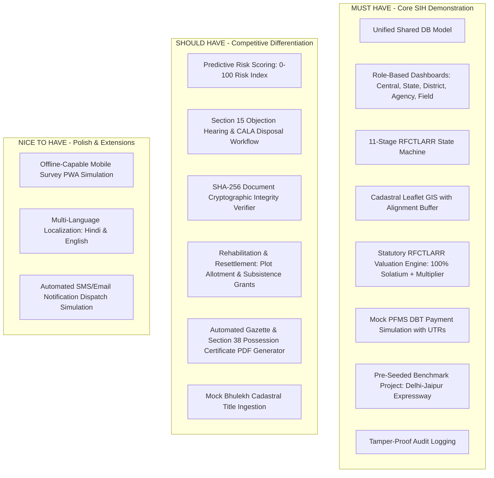

# National Land Acquisition & Management System (NLAMS)
## Development Plan & Implementation Roadmap (SIH 2026)

---

## 1. Technology Stack Evaluation & Decisions

| Layer | Proposed Stack | Evaluation & Recommendation | Rationale |
|---|---|---|---|
| **Frontend** | Next.js 14+ (App Router) + TypeScript | **Adopted** | First-class SSR/SSG support, fast client-side navigation, robust type safety, rapid UI development. |
| **UI Design System** | Tailwind CSS + shadcn/ui (Radix UI) | **Adopted** | Highly customizable, modern government portal look (glassmorphic cards, clean dark/light mode, crisp accessibility), zero bloat compared to heavy UI suites. |
| **Backend** | FastAPI (Python 3.11+) | **Adopted** | Asynchronous IO, auto-generated OpenAPI/Swagger specifications, high performance, clean dependency injection system. |
| **Data Validation** | Pydantic v2 | **Adopted** | Fast validation, strict schema enforcement matching frontend TypeScript types. |
| **Database & ORM** | PostgreSQL 16 + PostGIS / SQLAlchemy 2.0 (Async) | **Adopted** | Relational integrity for statutory financial records combined with native GIS polygon operations (`ST_Intersects`, `ST_Buffer`). SQLite fallback is supported for zero-config demo mode. |
| **Authentication** | Stateless JWT (Bearer) + Argon2 | **Adopted** | High security, role-based claims in payload, audited quick role-switching mechanism for live judge demonstrations. |
| **GIS Visualization** | Leaflet + React-Leaflet + OpenStreetMap / Bhuvan Tiles | **Adopted** | Lightweight, high frame rate vector rendering for hundreds of cadastral Khasra polygons without WebGL overhead. |
| **Analytics & Visuals** | Recharts | **Adopted** | Smooth animations, responsive charts, clean integration with React state. |
| **Containerization** | Docker & Docker Compose | **Adopted** | One-command full-stack startup (`docker compose up`) for automated evaluation and local replication. |

---

## 2. MVP Scope Definition (SIH 2026)



### 2.1 MUST HAVE (Core Prototype)
1. **Unified Relational Data Model**: All modules referencing a single PostgreSQL data store.
2. **Interactive Role-Based Access Control**: Instant role switcher between `CENTRAL_OFFICER`, `DISTRICT_OFFICER`, `PROJECT_AGENCY`, `FIELD_OFFICER`, and `ADMIN`.
3. **11-Stage RFCTLARR Workflow Engine**: State transitions with mandatory statutory guards and approval queues.
4. **Interactive GIS Map**: Cadastral parcel polygons color-coded by acquisition status overlaid with expressway alignment corridor.
5. **Deterministic Compensation Engine**: Accurate calculation of base land rate, rural multiplier factor (1.00x–2.00x), 100% solatium, and 12% additional interest.
6. **Simulated PFMS Direct Benefit Transfer (DBT)**: Real-time payment batch creation, processing state, and simulated bank UTR receipt.
7. **Delhi–Jaipur Expressway Expansion Benchmark Dataset**: 500 acres, 420 acquired, 395 possession, ₹620 Cr assessed, ₹570 Cr disbursed, 1,240 PAFs.
8. **Audit Trail**: Real-time logging of user actions and stage transitions.

### 2.2 SHOULD HAVE (Advanced Features)
1. **Predictive Risk Scoring (0–100)**: Proactive bottleneck identification based on litigation, title fragmentation, and statutory deadline drift.
2. **Section 15 Objection Management**: Filing, scheduling hearings, recording CALA speaking orders.
3. **R&R Colony Management**: Tracking homestead plot allotments, subsistence grants, and civic amenities.
4. **SHA-256 Document Verification**: Live hash calculation to prove document non-tampering.
5. **MIS Report Exporter**: PDF / Excel summary exports.

### 2.3 NICE TO HAVE (Future Additions)
1. Offline field surveyor mobile PWA mode.
2. Bi-lingual UI (English / Hindi).
3. Mock WhatsApp/SMS alert dispatch simulation.

---

## 3. Phased Implementation Sequence

To minimize integration issues and maintain a rock-solid single data model, implementation will follow 8 sequential phases:

```
Phase 1: Project Foundation & Data Model Setup
   ↓
Phase 2: Authentication, RBAC & Core API Layer
   ↓
Phase 3: Acquisition Workflow & RFCTLARR Engine
   ↓
Phase 4: GIS & Cadastral Mapping Engine
   ↓
Phase 5: Financial Disbursements (PFMS) & Possession Module
   ↓
Phase 6: Rehabilitation & Resettlement (R&R) & Documents
   ↓
Phase 7: Analytics, Predictive Risk & MIS Reporting
   ↓
Phase 8: End-to-End Verification & Benchmark Data Polish
```

### Phase 1: Project Foundation & Core Persistence
- Initialize Next.js frontend with Tailwind CSS and shadcn/ui components.
- Initialize FastAPI backend with async SQLAlchemy ORM and Alembic migrations.
- Set up Docker Compose for local PostgreSQL 16 (with PostGIS).
- Define all core models (`User`, `Project`, `LandParcel`, `LandOwner`, `Notification`, `Compensation`, `Award`, `Disbursement`, `Possession`, `RAndR`, `AuditLog`).

### Phase 2: Authentication, RBAC & Core Project Management
- Implement JWT login, token refresh, and password hashing.
- Build quick-role-switcher for testing.
- Implement Project creation, list, filtering, and 360° detail views.

### Phase 3: Statutory Workflow & RFCTLARR Valuation Engine
- Codify the 11-stage finite state machine with transition validation guards.
- Implement the RFCTLARR statutory calculation logic (Base rate × Multiplier + Assets + 100% Solatium + 12% Interest).
- Build the task approval queue for CALA and Field Officers.

### Phase 4: Cadastral GIS & Spatial Alignment Engine
- Integrate Leaflet map in Next.js with OpenStreetMap/Bhuvan raster layers.
- Render project corridor right-of-way buffer and color-coded village parcel polygons.
- Implement parcel inspector side-drawer with owner details, valuation breakdown, and status actions.

### Phase 5: Compensation Disbursement (PFMS) & Possession Handover
- Build PFMS payment batch generation and simulated DBT webhook callback.
- Generate bank UTR numbers and update disbursement status in real time.
- Implement Section 38 Possession Handover certificate generation.

### Phase 6: Rehabilitation & Resettlement (R&R) & Document Management
- Implement PAF/PDF enumeration and 2nd Schedule entitlement calculator.
- Build resettlement colony plot allotment and subsistence grant tracker.
- Implement SHA-256 document uploader and live cryptographic integrity validator.

### Phase 7: Analytics, Predictive Risk Engine & MIS Reports
- Build National and State KPI dashboards (funnel charts, financial burn s-curves).
- Implement the 5-factor Predictive Risk Scoring algorithm (0–100).
- Build MIS report generator with PDF/Excel export capabilities.

### Phase 8: Comprehensive Demo Seeding & Polish
- Seed the "Delhi–Jaipur Expressway Expansion (NH-48 Package IV)" project with 500 proposed acres, 420 acquired acres, ₹620 Cr assessed, ₹570 Cr paid, 1,240 PAFs.
- Conduct end-to-end integration walkthrough across all 6 stakeholder roles.

---

## 4. Key Architectural Risks & Mitigation Strategies

| Risk | Impact | Likelihood | Mitigation Strategy |
|---|---|---|---|
| **1. Disconnected Data Model** | High | Low | Single unified PostgreSQL database schema. No isolated in-memory states or duplicate mock models. |
| **2. Complex RFCTLARR Calculations** | High | Medium | Encapsulate valuation math in a dedicated, unit-tested `ValuationService` implementing strict statutory formulas. |
| **3. GIS Performance Lag** | Medium | Low | Use optimized GeoJSON with centroid simplification; render vector polygons using lightweight Leaflet canvas renderer. |
| **4. Database Environment Friction** | Medium | Low | Support dual backend mode: PostgreSQL+PostGIS in Docker as standard, with clean SQLite/JSON fallback if Docker is unavailable. |
| **5. Demo Role Confusion for Judges** | High | Medium | Provide prominent one-click "Role Switcher" banner in the header showing active permissions and context. |
| **6. Statutory Lapsing Drift** | High | Low | Implement automated SLA alert engine warning of Section 11 to Section 25 lapsing risks. |

---

## 5. Non-Negotiable Architectural Rules

1. **No Application Code in Planning Phase**: Do not generate frontend components or backend endpoints until the user explicitly approves the implementation plan.
2. **Unified Data Integrity**: Every parcel belongs to a project; every compensation assessment belongs to a parcel; every disbursement links to an award and owner. No orphan records.
3. **Statutory Guard Enforcement**: Stage transitions cannot bypass required conditions (e.g. Award declaration cannot precede Section 19 declaration).
4. **Audit Immutability**: All state-altering operations must write an unalterable log to `audit_logs`.
5. **No Blind Tech Additions**: Stick strictly to Next.js + FastAPI + PostgreSQL + Leaflet + Tailwind/shadcn. Do not add redundant libraries.
