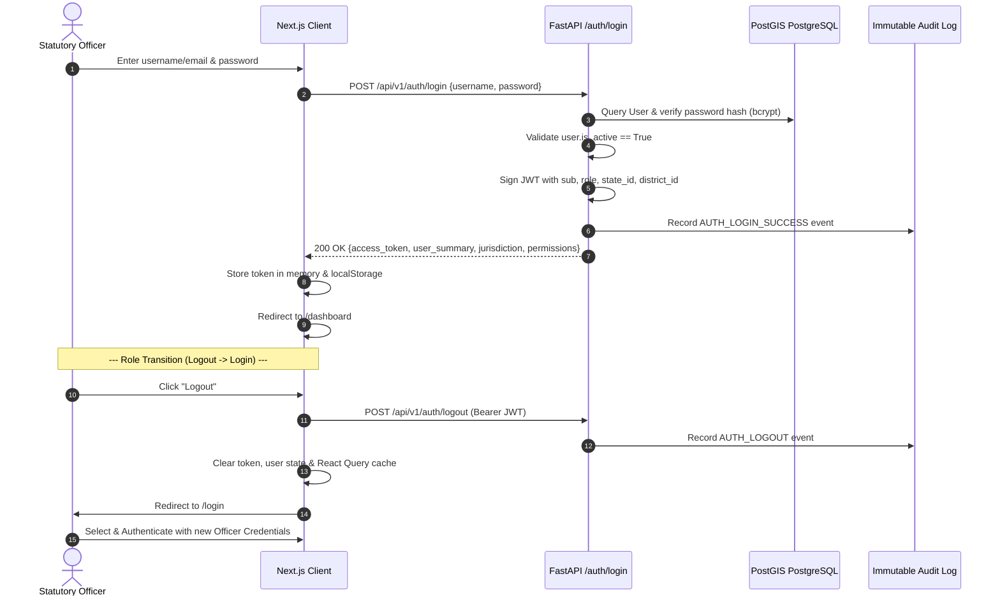

# NLAMS Authentication, Role Identity & Jurisdiction Model

**System**: National Land Acquisition & Management System (NLAMS)  
**Standard**: RFCTLARR Act 2013 Statutory Compliance & Security Architecture  
**Document Version**: 1.0 (Phase 11A)

---

## 1. Executive Principle: Identity Equation

NLAMS is a hierarchical sovereign workflow and decision platform. User authorization is never a frontend preference or client-side selector. A user's role and jurisdiction are part of their authenticated identity:

$$\text{USER ID} + \text{PASSWORD} + \text{AUTHENTICATED SESSION} + \text{ROLE} + \text{JURISDICTION} = \text{AUTHORIZED NLAMS EXPERIENCE}$$

### Core Architectural Rules:
1. **No Fake Role Switcher**: The frontend must never provide "Switch Role", "Act as...", or "Change Role" dropdowns that mutate permissions without authenticating.
2. **Server-Side Security Boundary**: Backend APIs derive user identity and role solely from cryptographically signed JWT session tokens. The backend never trusts `user_id`, `role`, or `jurisdiction` passed as client request parameters.
3. **Session Lifecycle Enforced**: Logging out invalidates the client session token, purges stored state, and immediately redirects to `/login`. Protected routes reject unauthenticated requests with HTTP 401.

---

## 2. Canonical Operational Roles & Hierarchy

NLAMS defines six canonical operational roles and one administrative role matching the statutory governance tiers of the RFCTLARR Act 2013:

| Canonical Role Code | Operational Title | Primary Mandate & Statutory Function | Default Jurisdiction Scope |
| :--- | :--- | :--- | :--- |
| `ROLE_CENTRAL_OFFICER` | Central Ministry Officer | National project pipeline monitoring, central sanctioning, inter-state corridor coordination, MoRTH apex dashboard | National (All States / Districts) |
| `ROLE_STATE_OFFICER` | State Revenue Officer | State-level Section 19 declaration reviews, state gazette notifications, district collector oversight | State Mandate (e.g. `IN-RJ` Rajasthan) |
| `ROLE_DISTRICT_OFFICER` | District Collector & CALA | Competent Authority for Land Acquisition, Section 15 objection hearings, Section 23 awards, PFMS DBT disbursements, Section 38 possession orders | District Mandate (e.g. `DST-JAI` Jaipur) |
| `ROLE_PROJECT_AGENCY` | Project Implementing Agency | DPR upload, alignment submission, compensation escrow deposits, possession handover requests (e.g. NHAI PIU) | Project Scope (e.g. `PRJ-NH48-PKG4`) |
| `ROLE_FIELD_OFFICER` | Field Survey Officer (Patwari) | Ground truthing, asset valuation (structures, trees, borewells), KYC verification, field GeoJSON polygon uploads | Tehsil Scope (e.g. `TEH-KOT` Kotputli) |
| `ROLE_SOCIAL_OFFICER` | Social Development & R&R Officer | Resettlement & Rehabilitation (R&R) schemes, family census, entitlement matrix validation, alternative land allotments | R&R Scheme / District Scope (`DST-JAI`) |
| `ROLE_ADMIN` / `ROLE_SUPER_ADMIN` | System Administrator | Platform taxonomy, user provisioning, security audit logs, emergency administrative overrides | National Platform Infrastructure |

---

## 3. Jurisdiction Hierarchy & Scoping Model

Administrative authority cascades strictly through the constitutional hierarchy:

```
                  ┌───────────────────────────────┐
                  │    CENTRAL_OFFICER / ADMIN    │  (National Scope: All India)
                  └───────────────┬───────────────┘
                                  │
                                  ▼
                  ┌───────────────────────────────┐
                  │         STATE_OFFICER         │  (State Scope: e.g. Rajasthan IN-RJ)
                  └───────────────┬───────────────┘
                                  │
                                  ▼
                  ┌───────────────────────────────┐
                  │ DISTRICT_OFFICER / SOCIAL_OFF │  (District Scope: e.g. Jaipur DST-JAI)
                  └───────────────┬───────────────┘
                                  │
                                  ▼
                  ┌───────────────────────────────┐
                  │         FIELD_OFFICER         │  (Tehsil/Task Scope: Kotputli TEH-KOT)
                  └───────────────┬───────────────┘
                                  │
                                  ▼
                     ┌─────────────────────────┐
                     │ Village Cadastral Parcel│
                     └─────────────────────────┘
```

### Hierarchical Visibility Principle:
- **Higher-tier officers may VIEW subordinate progress**:
  - `CENTRAL_OFFICER` can view all states, districts, projects, and parcels.
  - `STATE_OFFICER` can view all districts, projects, and parcels within their assigned state.
  - `DISTRICT_OFFICER` can view all projects, parcels, and field survey tasks within their district.
  - `FIELD_OFFICER` can view only assigned field survey tasks and parcel boundaries.
- **Higher visibility does NOT grant unauthorized edit authority**:
  - A Central Officer cannot declare a Section 23 Award (sole statutory authority of CALA).
  - A CALA cannot approve a Central sanction without central authority.

---

## 4. Authentication Flow & Session Lifecycle



---

## 5. Backend Authorization Enforcement

Every protected backend endpoint enforces multi-layered authorization:

1. **Authentication Gate (`get_current_user`)**:
   - Parses `Authorization: Bearer <token>` header.
   - Verifies JWT digital signature and expiry using `SECRET_KEY` and `HS256`.
   - Rejects unauthenticated requests with HTTP `401 UNAUTHORIZED`.
   - Validates that `user.is_active == True` (deactivated users receive HTTP `403 ACCOUNT_DEACTIVATED`).

2. **Role Enforcement (`require_roles`)**:
   - Compares the authenticated user's `role_id` against declarative endpoint whitelist.
   - Example: Section 23 Award declaration requires `ROLE_DISTRICT_OFFICER` or `ROLE_ADMIN`.
   - Unauthorized roles receive HTTP `403 FORBIDDEN_ROLE`.

3. **Jurisdiction Scoping (`check_jurisdiction` / `enforce_jurisdiction`)**:
   - Asserts that target project/parcel location matches user's administrative boundaries.
   - Cross-state or cross-district manipulation receives HTTP `403 OUTSIDE_JURISDICTION`.

---

## 6. Pre-Seeded Canonical Demo Accounts

The following accounts are available for evaluation and automated testing:

| Username | Operational Role | Jurisdiction Scope | Password |
| :--- | :--- | :--- | :--- |
| `central_admin` | Central Ministry Officer | National (All India) | `Password@123` |
| `state_rj_officer` | State Revenue Officer | Rajasthan (`IN-RJ`) | `Password@123` |
| `cala_jaipur` | District Collector & CALA | Jaipur District (`DST-JAI`) | `Password@123` |
| `nhai_pd_jaipur` | Project Implementing Agency | NHAI Jaipur (`PRJ-NH48-PKG4`) | `Password@123` |
| `patwari_kotputli` | Field Officer / Surveyor | Tehsil Kotputli (`TEH-KOT`) | `Password@123` |
| `randr_jaipur` | Social Development & R&R Officer | Jaipur R&R Schemes (`DST-JAI`) | `Password@123` |
| `admin` | System Administrator | Apex Platform Infrastructure | `Password@123` |

---

## 7. Compliance with RFCTLARR Act 2013

By binding roles directly to server-validated authentication tokens rather than mutable client states:
- **Statutory Non-Repudiation**: Every award, hearing, survey, and disbursement is cryptographically tied to the designated officer.
- **Audit Integrity**: All logins, logouts, and operational actions are logged to the `audit_logs` table with timestamp and IP origin.
- **Separation of Concerns**: Acquiring bodies (NHAI) cannot approve their own awards; CALA cannot approve central budgetary sanctions.
