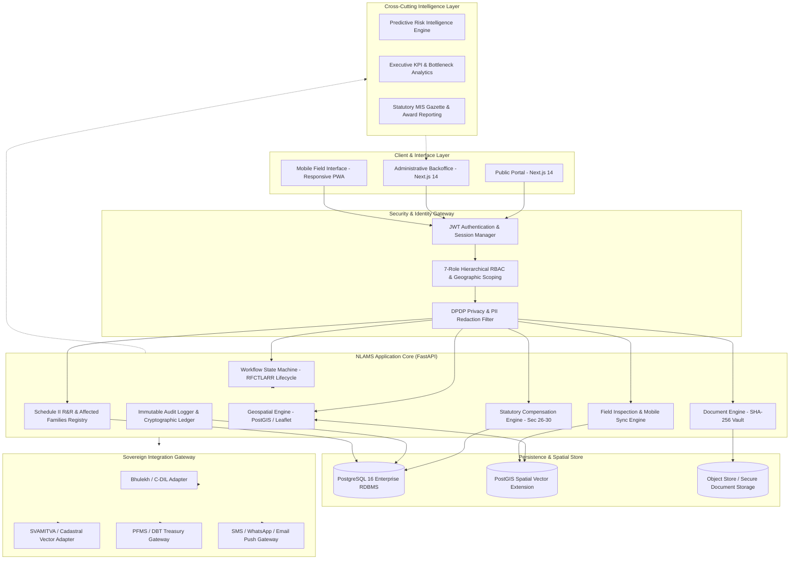

# NLAMS — System Architecture Specification
**Project**: National Land Acquisition & Management System (NLAMS)  
**Document**: Technical Architecture Specification & Component Model  
**SIH 2026 Submission Document**

---

## 1. High-Level Structural Diagram

```
                              ┌────────────────────────┐
                              │     PUBLIC PORTAL      │
                              │ (Citizen Transparency) │
                              └───────────┬────────────┘
                                          │
                                          ▼
                              ┌────────────────────────┐
                              │  AUTHENTICATION & RBAC │
                              │ (JWT / Session / Role) │
                              └───────────┬────────────┘
                                          │
                                          ▼
                         ┌──────────────────────────────────┐
                         │        NLAMS APPLICATION         │
                         │    (Next.js 14 App Router)       │
                         └────────────────┬─────────────────┘
                                          │
        ┌─────────────────────────────────┼─────────────────────────────────┐
        │                                 │                                 │
  ┌───────────┐                     ┌───────────┐                     ┌───────────┐
  │ Workflow  │                     │    GIS    │                     │ Documents │
  │  Engine   │                     │  Viewer   │                     │  Manager  │
  └─────┬─────┘                     └─────┬─────┘                     └─────┬─────┘
        │                                 │                                 │
  ┌─────┴─────┐                     ┌─────┴─────┐                     ┌─────┴─────┐
  │Compensat- │                     │   Field   │                     │Audit/RBAC │
  │ion Engine │                     │Inspection │                     │ Governance│
  └─────┬─────┘                     └─────┬─────┘                     └─────┬─────┘
        │                                 │                                 │
        └─────────────────────────────────┼─────────────────────────────────┘
                                          │
                                          ▼
                         ┌──────────────────────────────────┐
                         │        FASTAPI REST API          │
                         │   (Asynchronous Python Core)     │
                         └────────────────┬─────────────────┘
                                          │
                                          ▼
                         ┌──────────────────────────────────┐
                         │      PostgreSQL + PostGIS        │
                         │  (Relational + Spatial Engine)   │
                         └────────────────┬─────────────────┘
                                          │
                                          ▼
                         ┌──────────────────────────────────┐
                         │       INTEGRATION GATEWAY        │
                         │    (Micro-Adapter Architecture)  │
                         └────────────────┬─────────────────┘
                                          │
        ┌─────────────────┬───────────────┴───────────────┬─────────────────┐
        │                 │                               │                 │
  ┌───────────┐     ┌───────────┐                   ┌───────────┐     ┌───────────┐
  │   Land    │     │ Cadastral │                   │ PFMS/DBT  │     │ Notifica- │
  │  Records  │     │    GIS    │                   │ Payments  │     │   tions   │
  │ (Bhulekh) │     │(SVAMITVA) │                   │ (Treasury)│     │(SMS/WA/EM)│
  └───────────┘     └───────────┘                   └───────────┘     └───────────┘

  ═════════════════════════════════════════════════════════════════════════════════
  CROSS-CUTTING LAYER: Analytics Engine · Predictive Risk Scoring · Executive MIS
  ═════════════════════════════════════════════════════════════════════════════════
```

---

## 2. Mermaid Architectural Specification



---

## 3. Tiered Layer Descriptions

### Tier 1: Client & Presentation Layer
- **Public Portal**: Unauthenticated citizen interface built on Next.js 14 App Router. Displays project notices, public gazette publications, generic corridor maps, and grievance submission without exposing landholder PII.
- **Administrative Backoffice**: Authenticated workspace for government stakeholders. Includes dynamic role-tailored navigation, dashboard metric visualization, interactive GIS mapping, and workflow transition dialogs.
- **Field Inspector Portal**: Mobile-responsive web view optimized for touch, camera geotagging, offline parcel inspection, and low-bandwidth rural operations.

### Tier 2: Authentication, RBAC & Privacy Gateway
- **Token Manager**: Stateless JWT with cryptographic HMAC signing, configurable expiration, and automatic refresh cycles.
- **Hierarchical RBAC**: Enforces permissions across 7 discrete roles (*Central Officer*, *State Admin*, *CALA / District Collector*, *Valuation Officer*, *Field Surveyor*, *System Admin*, *Public Citizen*).
- **Geographic Scoping**: Restricts database write and approval capabilities to designated state, district, and tehsil jurisdictions.
- **DPDP Privacy Shield**: Dynamic masking of personal identifiers (Aadhaar: `XXXX-XXXX-8921`, Bank Account: `******1234`) across unprivileged roles and public views.

### Tier 3: Core Application Engines
- **RFCTLARR Workflow Engine**: State machine governing the 8 statutory stages. Validates stage prerequisites (e.g., Section 15 objection disposal prior to Section 19 declaration).
- **Statutory Compensation Engine**: Deterministic calculation executing Sections 26–30 (Base rate $\times$ Rural multiplier $+$ Section 29 structures $+ 100\%$ Solatium $+ 12\%$ Interest).
- **Cadastral GIS Engine**: PostGIS spatial processing performing geometric intersection of highway corridors against parcel polygons, boundary buffering, and GeoJSON generation.
- **R&R Entitlement Engine**: Tracks affected families (PAFs) under Schedule II, housing allowances, subsistence grants, and resettlement infrastructure.
- **Field Sync Service**: Ingests survey reports with GPS coordinates, boundary notes, and photos, updating parcel verification statuses.
- **Audit & Hashing Service**: Computes SHA-256 digests on all state transitions, financial disbursement approvals, and uploaded documents.

### Tier 4: Cross-Cutting Intelligence Layer
- **Predictive Risk Engine**: Evaluates statutory schedule proximity, objection concentration, disbursement delay, and environmental clearances to produce an explainable 0–100 risk score.
- **Executive MIS & Bottlenecks**: Aggregates multi-district acquisition velocity, identifies administrative blockages, and generates statutory reports.

### Tier 5: Persistence & Spatial Tier
- **PostgreSQL 16**: Enterprise relational database with ACID compliance, connection pooling, and multi-tenant partitioning by Project and State.
- **PostGIS 3.4**: Native geospatial extension providing spatial indexing (GiST), ST_Intersects, ST_Buffer, and coordinate reference system (EPSG:4326 / EPSG:3857) transforms.
- **Secure File Storage**: Versioned repository for gazette notifications, award letters, survey sketches, and objection filings with cryptographic integrity checks.

### Tier 6: Sovereign Integration Gateway
- **Bhulekh Sandbox Gateway**: Interfaces with state revenue record formats (RoR), owner names, and encumbrance statuses.
- **Cadastral Vector Gateway**: Integrates drone and cadastral survey data compliant with SVAMITVA standards.
- **PFMS / DBT Gateway**: Simulates treasury disbursement mandates, UTR number issuance, and bank acknowledgment cycles.
- **Citizen Communication Gateway**: Delivers automated SMS, WhatsApp, and email alerts for statutory notices, hearing calls, and award credits.
